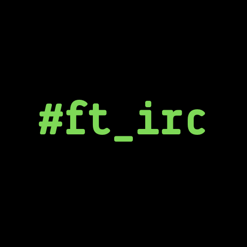

<div id="top"></div>
<p align=center>
  
  
  
  
  
  
</p>

<!-- PROJECT LOGO -->
<br />
<div align="center">
  <a href="https://github.com/othneildrew/Best-README-Template">
   
  </a>
</div>

<!-- TABLE OF CONTENTS -->
<details>
  <summary>Table of Contents</summary>
  <ol>
   <li>
    <a href="#about-the-project">About The Project</a>
    <ul>
      <li><a href="#built-with">Built With</a></li>
    </ul>
   </li>
   <li>
    <a href="#getting-started">Getting Started</a>
    <ul>
      <li><a href="#prerequisites">Prerequisites</a></li>
      <li><a href="#installation">Installation</a></li>
    </ul>
   </li>
   <li><a href="#usage">Usage</a></li>
   <li><a href="#roadmap">Roadmap</a></li>
   <li><a href="#contact">Contact</a></li>
   <li><a href="#acknowledgments">Acknowledgments</a></li>
  </ol>
</details>

<!-- ABOUT THE PROJECT -->
## About The Project

</img>

ft_irc is a 42 project, aiming to create an IRC server written in C++, compliant with IRC's RFC

You can find full subject <a href="/docs">here</a>

<p align="right">(<a href="#top">back to top</a>)</p>

### Built With

* [C++](https://en.wikipedia.org/wiki/C%2B%2B)

<p align="right">(<a href="#top">back to top</a>)</p>

<!-- GETTING STARTED -->
## Getting Started

### Prerequisites

* clang

* Lime Chat (for Mac OS)

### Installation

* Clone the repo

  ```sh
  git clone https://github.com/kemadev/ft_irc.git
  ```

* Build the project using make

  ```sh
  make
  ```

<p align="right">(<a href="#top">back to top</a>)</p>

<!-- USAGE EXAMPLES -->
## Usage

* Launch the program

  ```sh
  ./bin/irc_server <port> <password>
  ```

* Connect your IRC client to the server using appropriate port and password

<p align="right">(<a href="#top">back to top</a>)</p>

<!-- ROADMAP -->
## Roadmap

- The project is finished and no further work is planned on it

See the [open issues](https://github.com/kemadev/ft_irc/issues) for a full list of proposed features (and known issues).

<p align="right">(<a href="#top">back to top</a>)</p>

<!-- CONTACT -->
## Contact

We are two creators :

kemadev - [GitHub](https://github.com/kemadev)

dorianginisty - [GitHub](https://github.com/dorianginisty)

<p align="right">(<a href="#top">back to top</a>)</p>

## Acknowledgments

* [Img Shields](https://shields.io)
* [README.MD-Template](https://github.com/othneildrew/Best-README-Template)

<p align="right">(<a href="#top">back to top</a>)</p>
